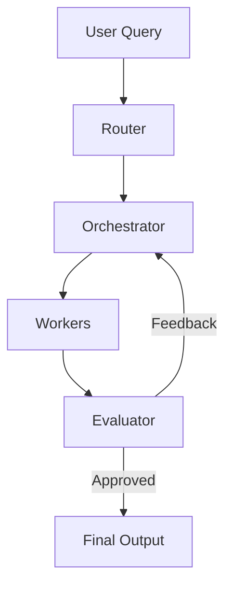

# Agentic Design Patterns

This document outlines the three key patterns implemented in this project:

## 1. Routing Pattern

**Purpose**: Dynamically select the most appropriate worker(s) based on the user's intent.

**Implementation**:
- `agents/router.py` analyzes the query and selects the appropriate workers
- Uses `IntentType` to classify the query
- Returns a list of `WorkerType` that should handle the request

**Flow**:
1. Receive user query
2. Analyze intent
3. Select appropriate workers
4. Return worker list for execution

## 2. Orchestrator-Worker Pattern

**Purpose**: Coordinate and manage the execution of specialized workers.

**Implementation**:
- `agents/orchestrator.py` acts as the central coordinator
- Workers in `workers/` directory handle specific tasks
- Uses asyncio for parallel execution

**Flow**:
1. Create execution plan
2. Initialize required workers
3. Execute workers in parallel
4. Aggregate results
5. Generate final output

## 3. Evaluator-Optimizer Pattern

**Purpose**: Ensure quality and completeness of the output.

**Implementation**:
- `agents/evaluator.py` validates the output
- Provides feedback for improvements
- Can trigger reprocessing if needed

**Flow**:
1. Receive aggregated results
2. Evaluate against quality criteria
3. Provide feedback or approve output
4. Optionally trigger reprocessing

## Component Interactions

## Extensibility

1. **Adding New Workers**:
   - Create a new worker class in `workers/`
   - Update `WorkerType` enum
   - Update router to handle new worker type

2. **Adding New Tools**:
   - Add new tool in `tools/`
   - Update relevant workers to use the tool

3. **Customizing Evaluation**:
   - Modify `evaluator.py`
   - Adjust evaluation criteria and scoring
